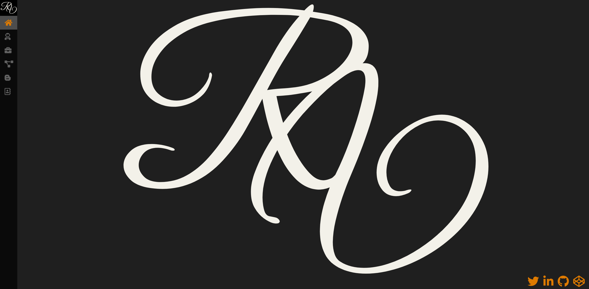
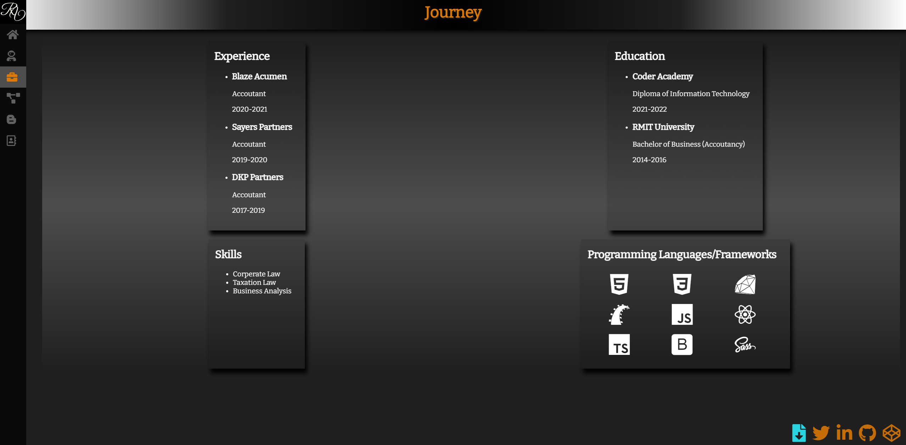
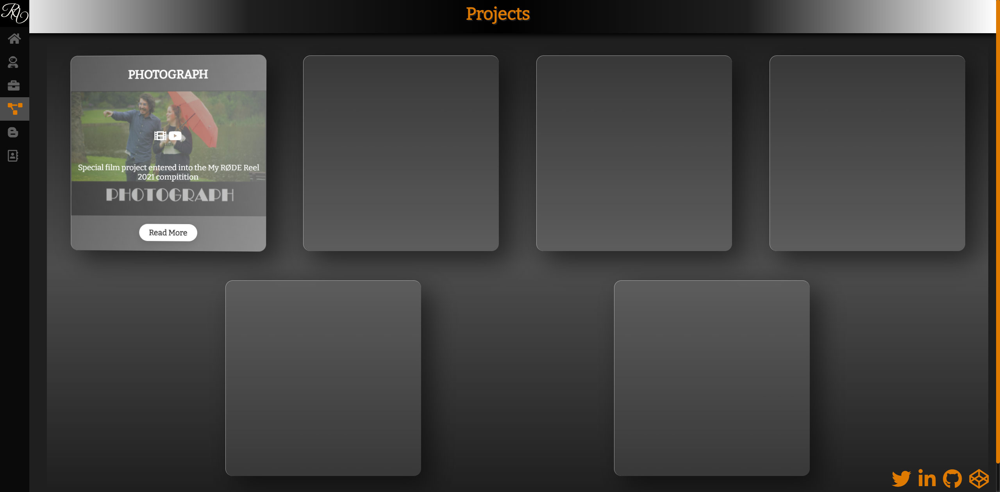
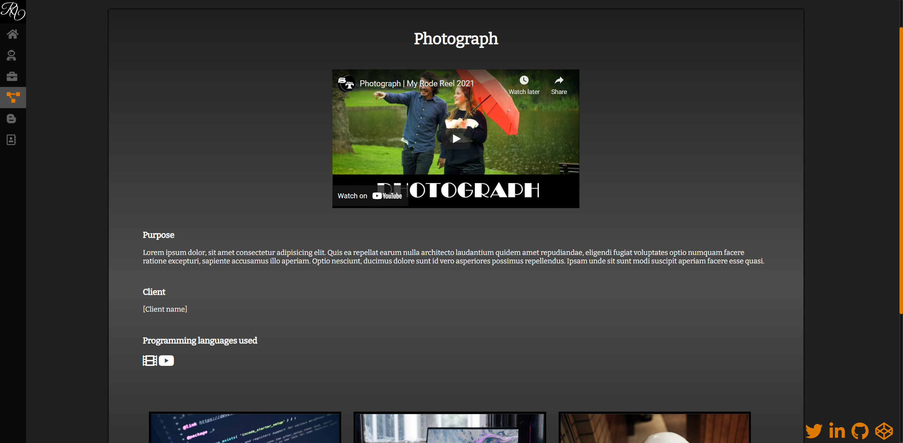
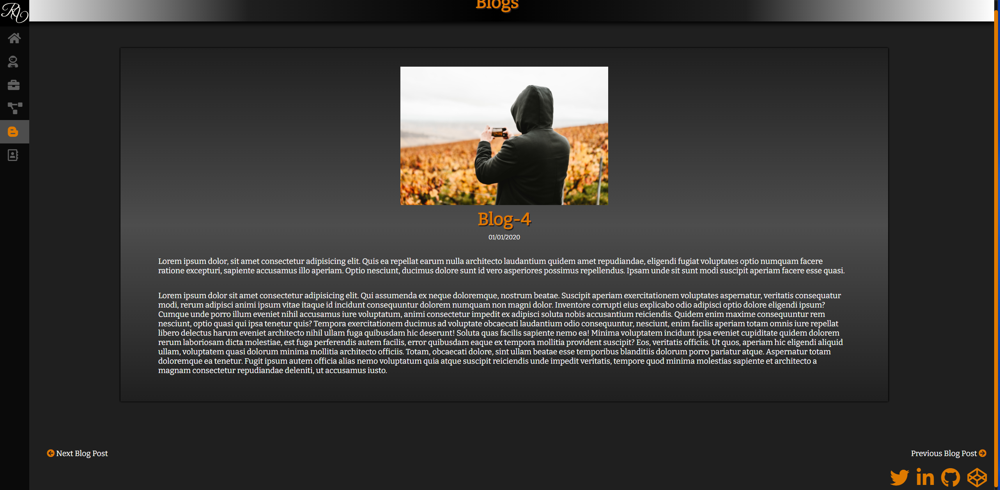
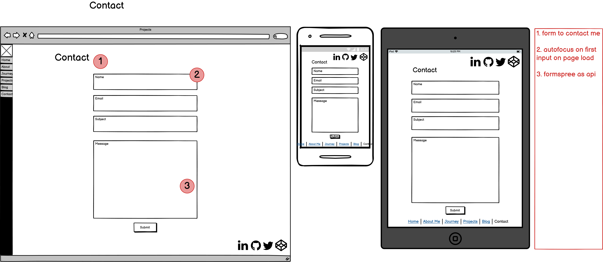
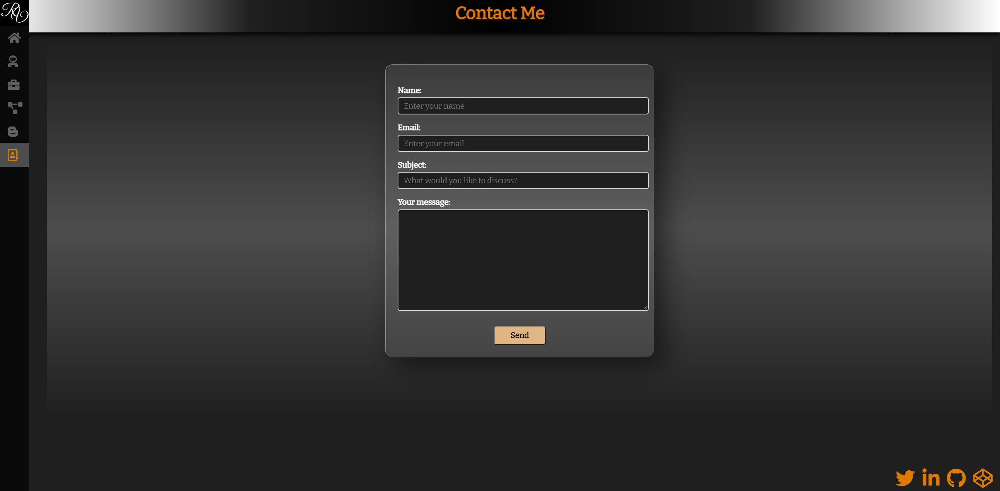

# Links

## Website Link
[Portfolio](https://raymondvo.netlify.app)

## Github Repository Link

[Github Repository](https://github.com/rayves/myportfolio)
# Purpose and Target Audience
This is a website I personally developed to highlight who I am and what projects I have in my portfolio. The aim of the website is to impress potential employers with the displayed portfolio.

# Overall Functionality
The website was designed to be easily navigable and engaging while easily understandable. This is achieved with:
- Social links on every page so external social linked can be easily accessed.
- Navigator on left side of page for full screen to maximise screen view as monitors are wide, then switching to horizontal with smaller screens, again for maximum view and ease.
  - when a smaller screen is used, the navigator is transformed from vertical on the left side to horizontal on the bottom to mimic a mobile app experience. This is done through media queries
- Current page in navigator is highlighted to show the current page the user is on.
- Logically placed components using styling.
- Logically used elements ie. <"header"> for headers. <"main"> for main area of content. <"section"> to separate different sections. "h" tags only used for actual headers and not as styling. The purpose for all this is for clear accessibility.
- All page's feature <"meta"> information for SEO purposes.
- Contact form utilising [Formspree](https://formspree.io/) as an API for messages to be sent (emailed) directly from the web page to me.

Images from [Unsplash](https://unsplash.com/) 

Icons from [FontAwesome](https://fontawesome.com/) and [Devicon](https://devicon.dev/)

Fonts from [Google-Fonts](https://fonts.google.com/)

The site's functionality and features are also detailed below as a walkthrough of each page.

# Sitemap

# Wireframes/Previews

## Homepage

I was inspired by an art gallery aesthetic when it came to my portfolio overall. I wanted my homepage to invoke feelings of ambiguity and intrigue as I believe this will spark the curiosity in people and drive them to delve further in the site. I achieved this by making my landing page a simple logo with a website navigator to the left and social links to the bottom.

**Features and functionality:**
- Navigation of the left side
- Logo in the center
- Social links in the bottom right corner that will remain constant for further investigation by visitors if wanting.
- Flexbox was key here for centralising and positioning.
## About Me

The about me page is where I make my introduction. Again, keeping the theme of walking through a gallery, I offer a summary of my journey, who I am, what I want to do, and of course an appreciation of your visit. I also wanted to offer I little inspiration by displaying a saying I live by. “Time waits for no one.” as you may say I will do it someday; time will not wait as it is always fleeting. Sometimes choices are better sooner rather than later. 

**Features and functionality:**

- Simple block of text
- Quote has absolute position until screen size shrinks, then position becomes relative for the page to have a column view.
- Social links in bottom right corner for visit to external links any time.
## Journey

The Journey page lists my experience, education, skills and known programming languages (not actually – only used for demo purposes). A downloadable resume is in the bottom left next to the social links, only difference here is the color is light blue for distinction. 
## Projects

The Projects page highlights the projects I have created. The projects are displayed as tiles that reveal an image and information when hovered over by a mouse. Clicking on the read more will direct to the project’s individual page. The tiles also feature a 3D reflective effect that is applied through javascript. As there is no hovering for touch screen devices, the hover feature is disabled for these users so that the information can still be seen. Flex box makes the tiles easily viewable regardless of screen size.

The final page differs from the wireframes as later in the development I realised that during the planning phase I was overcomplicating the site in an attempt to feature as many different styling methods as possible. To uncomplicate the design of the website I opted to scrap the original design and redesign for consistent features/functions.
## Individual Projects Page

The individual projects page features detailed description of the project in question and well as additional images that can be enlarged when hovered over by a mouse. An additional feature to be added when needed is a link to the github repository for the project. 
## Blog Main Page

Same as the Projects page, the page feature evenly spread-out tiles that reveal information when hovered over with read more <"a"> links that direct to individual blog's page. As these pages were displaying information, for consistency's sake the formatting was kept similar as to not overcomplicate the design.
## Inividial Blog Page

The individual blog page is simple in design. With an image & header at the top to attract attention, then the article content below. Depending on the content of the article, more elements can be added to expand the size of the content ie. more images or external embedded links. The page is kept within a certain width for easier reading with maintained focus on the center of the page.
## Contact Me

Finally, the contact page. The page features a form that allows users to send messages to me using [Formspree](https://formspree.io/) as an API.

The form has been styled to stay in theme with the design of the website. Each form input will light up the borders so that where focus is being applied is clear. All input areas have a 'required' attribute to validation to avoid accident message submissions or missing information that would make return contact difficult.

# Color Palette

# Tech Stack
## Planning
- [Balsamiq Wireframes](https://balsamiq.com/)
  - for layout and design planning
- [Diagrams.net](https://app.diagrams.net/)
  - planning sitemap design

## Software
- [VS Code](https://code.visualstudio.com/)
  - Coding environment
- [Adobe Illustrator](https://www.adobe.com/au/products/illustrator.html)
  - for vector design

## Coding
- HTML5
- CSS & SASS
- Javascript

## Deployment
- [Netlify](https://www.netlify.com/)